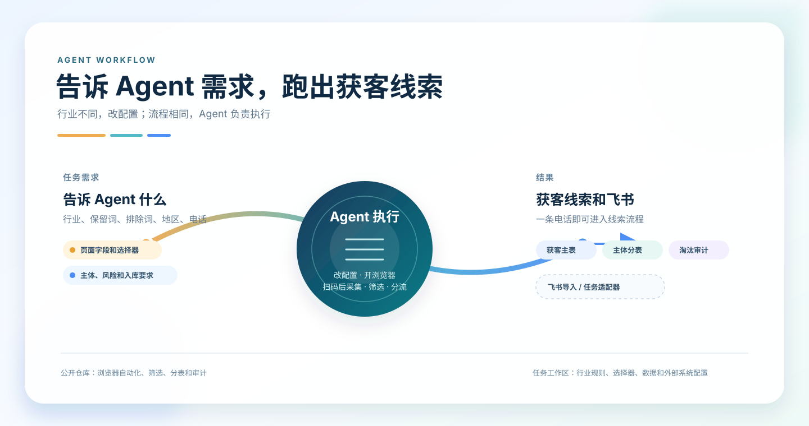
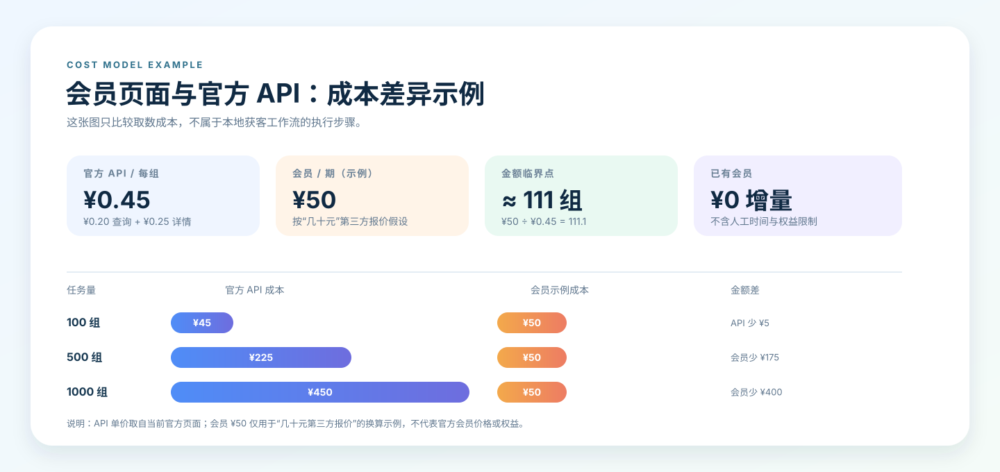
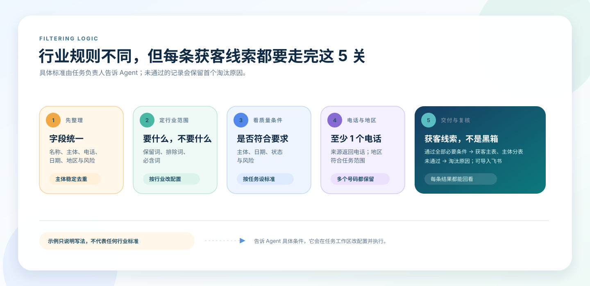

# Agent 获客流 & 天眼查

<p align="center">
  
</p>

这是一个把企业数据整理成可跟进获客线索的完整工作流。

它可以用 [Playwright 官方项目](https://github.com/microsoft/playwright) 打开可见浏览器。Agent 先按你的要求建立任务工作区；浏览器打开后，你在浏览器里扫码登录，告诉 Agent 可以继续，它再按任务自己的选择器读取结果、筛选、分表、导出和对接飞书。

```text
Playwright 浏览器自动化 / 已有数据 → 筛选规则 → 获客线索主表 / 主体分表 / 淘汰原因 → 飞书
```

公开仓库提供通用程序和虚构模板；真实任务配置和结果保留在任务工作区。

## 先告诉 Agent 什么

不同的行业有不同的筛选逻辑。开始前，把下面这些告诉 Codex、Claude Code、WorkBuddy、豆包或其他 Agent：

- 要查什么行业；
- 哪些词保留，哪些词排除；
- 哪些主体可以入库；
- 风险、日期、地区和电话要求；
- 页面字段和飞书字段怎么对应。
- 登录方式：让 Agent 打开浏览器；你完成扫码登录后，再告诉它继续。

Agent 会根据这些要求改任务工作区里的配置、选择器和导出字段。公开模板只是示例和思路，不是固定规则；你不需要先手写 YAML 或代码。页面已经在浏览器里时，Agent 可以先检查页面再改任务工作区的配置。完整沟通模板见 [AGENTS.md](AGENTS.md)。

## 成本差异：会员页面与官方 API

这一节只解释两条取数路径的成本差异，不是 Agent 执行本地工作流的步骤。

天眼查有两条常见的数据路径：

- **会员页面**：按会员权益使用；市场上（例如淘宝）会出现“几十元会员”的第三方报价例子。使用者在浏览器里完成扫码登录后，Agent 可以在可见浏览器中按任务配置查询、读取和导出结果。
- **官方 API**：由程序调用官方接口，按接口、按次数计费，更适合稳定的系统对接。

差别不在后面的筛选和导出，而在前面的取数成本与方式。已有会员时，新增查询的现金成本可能很低；官方 API 则会随着调用次数累加，但更方便接入自己的系统。

下面用一次行业/区域查询约 ¥0.2、一次企业详情约 ¥0.25 做换算。也就是，按“查询 + 详情”这一组计算，成本约为 ¥0.45；这只是帮助理解两条路径差异的示例。

<p align="center">
  
</p>

图中用第三方会员 ¥50 作为成本差异示例：

- 查约 111 组“查询 + 详情”时，API 成本和 ¥50 接近。
- 少于这个量，按这两个 API 计算，API 的钱可能更少。
- 多于这个量，会员的现金成本可能更低，但仍需要人工查询和导出。
- 如果会员本来就有，新增的数据查询成本接近 0；如果要做长期自动化，官方 API 更合适。

图中的 ¥50 是“会员几十元”的换算示例，不是天眼查官方会员价格。官方 API 价格以当期页面为准：[查询接口](https://open.tianyancha.com/open/776) · [企业详情接口](https://open.tianyancha.com/open/365)。

## 最终怎样进入获客名单

<p align="center">
  
</p>

每个行业的条件都不同，流程本身不变。公开示例只展示写法和思路；把行业、保留/排除条件、主体、风险、日期、地区、电话和飞书字段要求告诉 Agent 后，Agent 会在任务工作区改配置，不需要改公开仓库代码。

## Agent 怎么跑

把下面这件事交给 Agent 就够了：说明你要找的行业、地区、入库条件和电话要求，并告诉它“请打开浏览器，我会扫码登录，登录后我再说继续”。

Agent 接下来会按这个顺序做：

1. 先跑本地虚构示例，确认浏览器采集、筛选和导出链路可用。
2. 在仓库外创建任务工作区，并根据你的自然语言要求改行业 profile、浏览器选择器和飞书字段。
3. 打开可见浏览器，等待你扫码登录并进入结果页；你确认后，继续读取和翻页。
4. 生成电话总表、主体分表和未入选原因；需要时再写入飞书。

**满足前面筛选条件后，只要有一个来源返回的电话，就会进入获客名单。** 两个电话不是门槛；多个电话会一起保留。

## 可以放进飞书

工具会生成 JSONL、CSV、XLSX，可导入飞书。需要用命令行操作飞书时，直接使用飞书官方开源工具：[lark-cli](https://github.com/larksuite/cli)。

如果还没安装，直接告诉 Agent：“请帮我安装并验证 lark-cli”。

真实飞书对接在任务工作区配置。字段对应方式见 [飞书对接说明](docs/FEISHU_INTEGRATION.md)。

## 开始使用

```bash
git clone https://github.com/luu175ktovtsvor-spec/tianyancha-agent-kit.git
cd tianyancha-agent-kit
python3 -m venv .venv
source .venv/bin/activate
python -m pip install -e '.[dev,browser]'
python -m playwright install chromium

# 浏览器自动化：此命令会打开可见浏览器并等待登录完成
tyc-agent browser-collect \
  --browser-profile /path/to/task-workspace/browser-profile.yaml \
  --output /path/to/task-workspace/captured-records.json

# 对浏览器采集结果做筛选和导出
tyc-agent phone-leads \
  --profile examples/industry-profile.example.yaml \
  --input /path/to/task-workspace/captured-records.json \
  --input-kind canonical \
  --format xlsx \
  --output-dir /path/to/task-workspace/output
```

浏览器选择器配置可从 [公开模板](examples/browser-profile.example.yaml) 复制。更详细的筛选规则见 [筛选说明](docs/METHODOLOGY.md)，字段怎么写见 [配置说明](docs/PROFILE_RECIPES.md)。

## 5 分钟跑通完整示例

示例使用本地虚构网页，因此不需要账号。

已经安装依赖后，Agent 可以直接运行：

```bash
bash scripts/run_demo.sh
```

它会自动启动本地网页、用无头 Playwright 采集 5 条虚构记录、生成 2 条获客线索和 3 条淘汰记录，并输出结果目录。

这个示例会从虚构结果页读取 5 条记录，并生成 2 条获客线索、3 条淘汰记录。

把仓库交给 Agent 时，先阅读根目录的 [AGENTS.md](AGENTS.md)。其中明确了安装、验收、真实任务所需资料和停止条件。

[MIT License](LICENSE)
